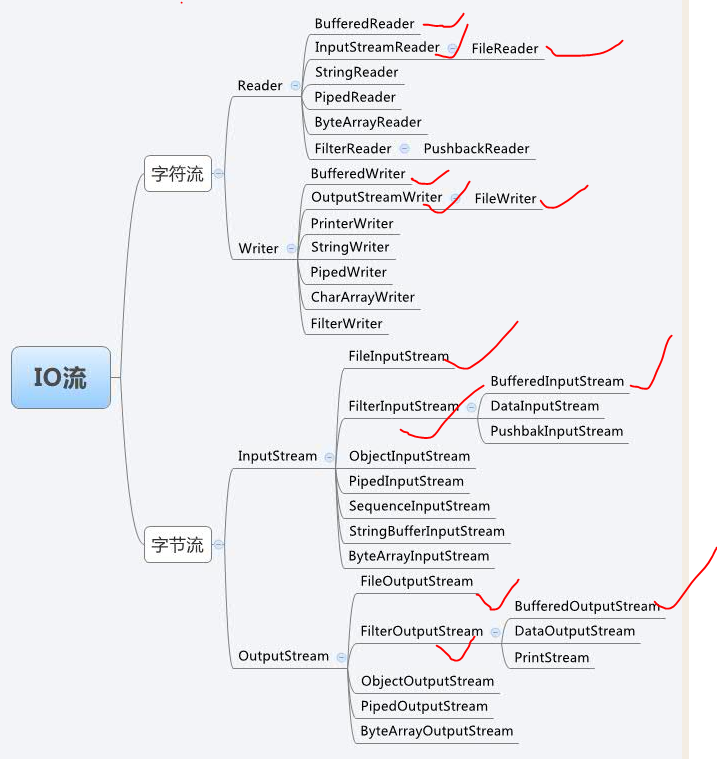

## IO操作
    - 1.对于File类，实际上是将对文件的操作封装成类，那么文件的属性就可以通过 
    这个类进行获得和设定，包括对路径进行操作
    - 2.FileInputStream/FileOutputStream
    - 3.BufferedInputStream是套在某个其他的InputStream外，起着缓存的功能，用来改善InputStream的性能(有效降低磁盘读写消耗);
    可以看作是BufferedInputStream对外提供滑动读取的功能实现，通过预先读入一整段原始输入流数据至缓冲区中，
    而外界对BufferedInputStream的读取操作实际上是在缓冲区上进行，如果读取的数据超过了缓冲区的范围，
    那么BufferedInputStream负责重新从原始输入流中载入下一截数据填充缓冲区，然后外界继续通过缓冲区进行数据读取



### 缓存读写
```java
@org.junit.Test
public void test3() throws IOException {

    BufferedInputStream bin=new BufferedInputStream(new FileInputStream("C:\\Users\\Administrator.PC1138\\IdeaProjects\\TEST\\src\\main\\java\\com\\zx\\mes\\proxy\\JKProxy.java"));
    BufferedOutputStream bout=new BufferedOutputStream(new FileOutputStream("C:/Users/Administrator.PC1138/Desktop/java.txt"));

    //正常
    //int r;
    //while ((r=bin.read())!=-1) {
    //    logger.info(JSON.toJSONStringWithDateFormat((char)r,"yyyy-MM-dd HH:mm:ss"));
    //    bout.write(r);
    //}

    byte[] b=new byte[1];//128时有问题
    while (bin.read(b)!=-1) {
        logger.info(JSON.toJSONStringWithDateFormat(new String(b),"yyyy-MM-dd HH:mm:ss"));
        bout.write(b);
    }

    bin.close();
    bout.flush();
    bout.close();
}
```

