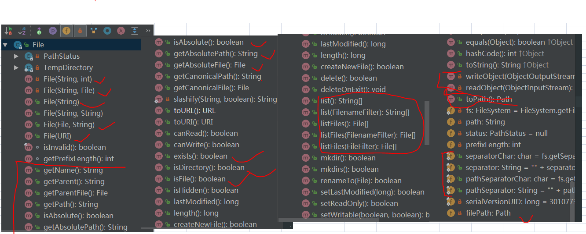

## 文件操作
    - 1.对于File类，实际上是将对文件的操作封装成类，那么文件的属性就可以通过 
    这个类进行获得和设定，包括对路径进行操作



### 遍历方法
```java
public List<String> getDirectories(File file){
        List<String> list=null;

        File[] flist=file.listFiles();
        if (flist==null || flist.length==0) {
            return list;
        }else{
            list=new ArrayList<String>();
        }

        for (int i=0;i<flist.length;i++) {
            if (flist[i].isDirectory()) {
                //所有的文件夹
                logger.info(JSON.toJSONStringWithDateFormat(flist[i].getAbsolutePath(),"yyyy-MM-dd HH:mm:ss"));
                list.add(flist[i].getAbsolutePath());
                getDirectories(flist[i]);
            }else {
                //所有的文件
                logger.info(JSON.toJSONStringWithDateFormat(flist[i].getAbsolutePath(),"yyyy-MM-dd HH:mm:ss"));
                list.add(flist[i].getAbsolutePath());
            }
        }

        return list;
    }
```

